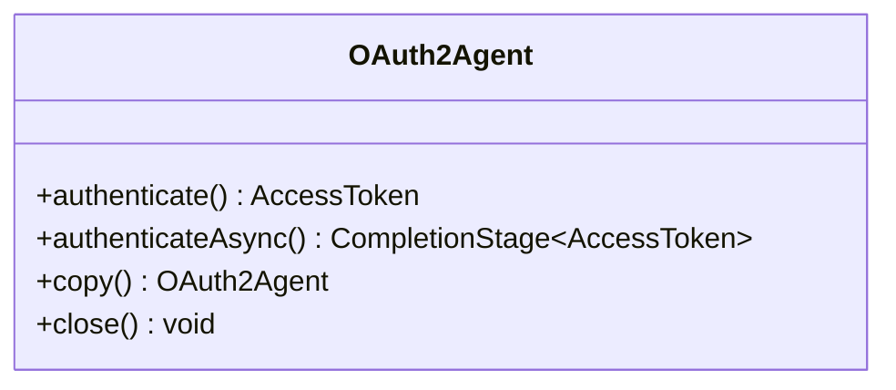
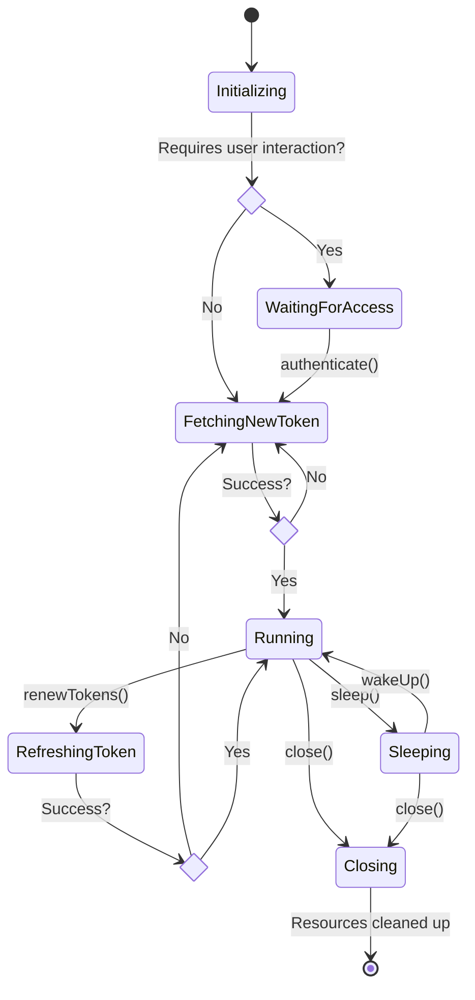
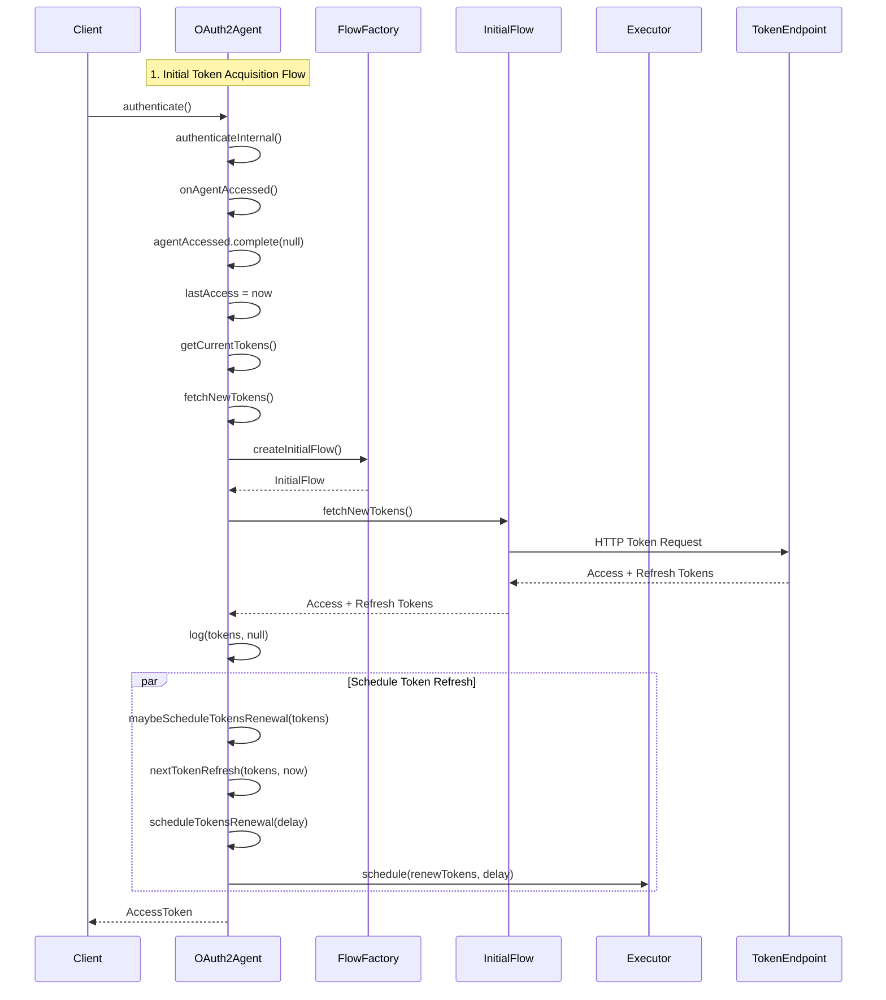
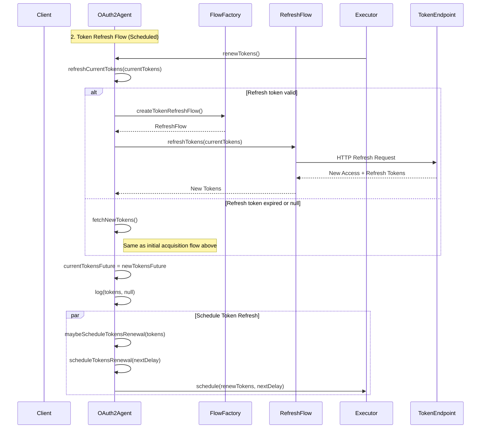
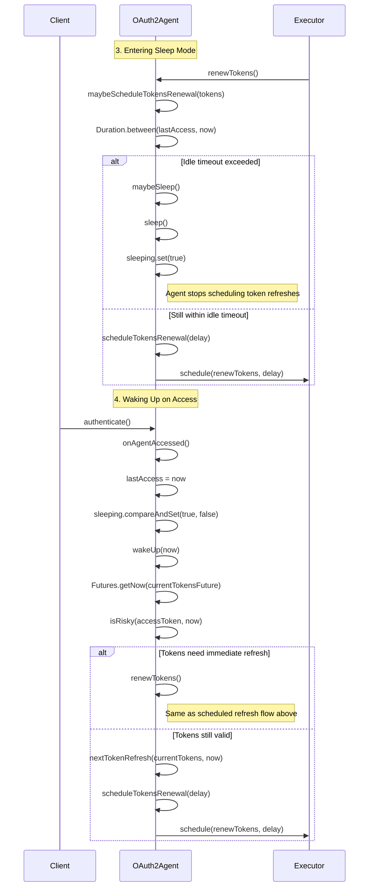

<!--
Copyright (C) 2025 Dremio Corporation

Licensed under the Apache License, Version 2.0 (the "License");
you may not use this file except in compliance with the License.
You may obtain a copy of the License at

    http://www.apache.org/licenses/LICENSE-2.0

Unless required by applicable law or agreed to in writing, software
distributed under the License is distributed on an "AS IS" BASIS,
WITHOUT WARRANTIES OR CONDITIONS OF ANY KIND, either express or implied.
See the License for the specific language governing permissions and
limitations under the License.
-->
# OAuth2 Agent

## Overview

The OAuth2 Agent is an OAuth2 client implementation that provides automatic token management, refresh capabilities, and
support for multiple OAuth2 grant types. It serves as the core component of Dremio's AuthManager for Apache Iceberg.

The agent's internals are fully asynchronous, non-blocking and employ a concurrency model designed for low-latency,
thread-safe operation.

At its core, the OAuth2 Agent is a *flow execution engine*. It fetches initial OAuth2 access tokens using various grant
types, then automatically refreshes tokens before they expire. It is agnostic of the specific grant type and dialect
used, and leverages the `FlowFactory` to create the appropriate flows.

It integrates tightly with Apache Iceberg's REST catalog by its ability to share the `RESTClient` and
`ScheduledExecutorService` provided by the REST catalog.

## Public API

The OAuth2 Agent is implemented in the `com.dremio.iceberg.authmgr.oauth2.agent.OAuth2Agent` class.

The public API of the agent is as follows:



The agent provides two main methods for authentication:

### Synchronous Authentication

When using `authenticate()`, the agent blocks until the token is available. This method is useful when you need to
synchronously obtain a token, for example, when making a blocking API call.

```java
AccessToken token = agent.authenticate();
```

Example of usage:

```java
try (OAuth2Agent agent = new OAuth2Agent(spec, executor, restClientSupplier)) {
    AccessToken token = agent.authenticate();
    // Use token for API calls
}
```

Note that the agent is `AutoCloseable`, so it is recommended to use it with try-with-resources to ensure proper cleanup.

### Asynchronous Authentication

When using `authenticateAsync()`, the agent returns a `CompletionStage` that completes when the token is available. This
method is useful when you need to asynchronously obtain a token, for example, when making a non-blocking API call.

```java
CompletionStage<AccessToken> tokenStage = agent.authenticateAsync();
```

Example of usage:

```java
try (OAuth2Agent agent = new OAuth2Agent(spec, executor, restClientSupplier)) {
   agent.authenticateAsync()
       .thenApply(token -> makeApiCall(token))
       .thenAccept(result -> processResult(result))
       .exceptionally(error -> handleError(error))
       .join();
}
```

### Agent Copying

When an init session is promoted to a catalog session, it is not possible to reuse its agent because the init session is
already closed by then, so the underlying agent is also closed.

That's why an agent can be copied. When an agent is copied, the copy shares the same tokens as the original agent, if
any. If token refresh is enabled, the copy will however have its own, independent token refresh schedule.

```java
OAuth2Agent copy = agent.copy(); 
```

## Internal Components

### Internal State

1. **Constructor parameters**
   - `OAuth2AgentSpec spec`: The agent's configuration.
   - `ScheduledExecutorService executor`: The executor used for asynchronous operations.
   - `Supplier<RESTClient> restClientSupplier`: The supplier used to provide REST clients.
2. **Internal components created by the agent**
   - `FlowFactory flowFactory`: The factory used to create OAuth2 flows.
   - `String name`: The agent's name, used for logging.
3. **Token management components**
   - `CompletableFuture<Tokens> currentTokensFuture`: The future that provides the current tokens.
   - `ScheduledFuture<?> tokenRefreshFuture`: The future that manages token refresh scheduling.
4. **State management**
   - `AtomicBoolean closing`: Flag indicating if the agent is closing.
   - `AtomicBoolean sleeping`: Flag indicating if the agent is sleeping.
   - `CompletableFuture<Void> agentAccessed`: Future that is completed when the agent is accessed.
   - `Instant lastAccess`: The timestamp of the last agent access.
5. **Logging**
   - `Instant lastWarn`: The timestamp of the last warning log.

### Internal Methods

1. **Token acquisition and renewal**
   - `fetchNewTokens()`: Fetches new tokens from the OAuth2 server.
   - `refreshCurrentTokens(Tokens)`: Refreshes the current tokens.
   - `renewTokens()`: Renews tokens by either refreshing or fetching new ones.
2. **Token refresh scheduling**
   - `maybeScheduleTokensRenewal(Tokens)`: Decides whether to schedule a token renewal task.
   - `scheduleTokensRenewal(Duration)`: Schedules the next token renewal task.
   - `nextTokenRefresh(Tokens, Instant)`: Calculates the delay until the next token refresh.
3. **State management**
   - `maybeSleep()`: Decides whether to enter the "sleeping" state.
   - `sleep()`: Enters the "sleeping" state.
   - `wakeUp(Instant)`: Wakes up from the "sleeping" state.
   - `onAgentAccessed()`: Called when the agent is accessed, wakes up from sleep if necessary.
4. **Logging**
   - `log(Tokens, Throwable)`: Logs token acquisition and renewal events.
   - `maybeWarn(Instant)`: Logs warnings while rate-limiting to prevent log spam.

## Agent Lifecycle

The agent follows a well-defined state machine. The main lifecycle states are defined below. See also the [state diagram
below](#agent-lifecycle-state-diagram) section for a more detailed description of the agent's state machine.

### Initializing

The `agentAccessed` future coordinates initial access. This future is used to trigger initial token acquisition for
grant types that require user interaction, such as the Authorization Code flow, and is completed when the user interacts
with the agent for the first time. This technique prevents the agent from prematurely starting token fetch operations,
and thus bothering the user with a login prompt, before an access token is actually needed.

When no user interaction is required, the `agentAccessed` future is completed immediately.

Once this future is completed, the agent then proceeds to the initial token fetch, then schedules the next token
refresh, and enters the "running" state. See the [sequence diagram below](#initial-token-acquisition-sequence-diagram)
for a detailed view of the initialization flow.

### Running

The agent is in the "running" state when it has acquired a token and is serving authentication requests normally.

While in this state, the agent schedules token refreshes as needed. See the [sequence diagram
below](#refresh-token-sequence-diagram) for a detailed view of the token refresh flow.

### Sleeping

The agent enters sleep mode when, during a scheduled token refresh, it detects that the time since the last access
exceeds the configured idle timeout. The agent then stops scheduling token refreshes and enters the "sleeping" state.
This mode prevents unnecessary token refreshes for idle agents.

The agent wakes up when it is accessed again, and reschedules a token refresh if needed, or fetches new tokens
immediately, if the current ones are expired.

See the [sequence diagram below](#idle-management-sequence-diagram) for a detailed view of the idle management flow.

### Closing

When `close()` is called for the first time, the agent cancels all its futures, which stops any pending token renewals,
and closes the `FlowFactory`. The `closing` field is used to prevent double close and also to detect and prevent race
conditions during shutdown.

## Token Lifecycle

Two futures are used to manage token state and refresh operations:

- `currentTokensFuture`: Ensures visibility of token updates across threads.
- `tokenRefreshFuture`: Manages scheduled refresh operations.

Both fields are volatile.

The `currentTokensFuture` is the most important one since it provides the current tokens to all callers; it is rotated
when tokens are renewed.

The `tokenRefreshFuture` is a `ScheduledFuture` and is rotated when a new token refresh task is scheduled. There cannot
be more than one active token refresh operation at a time, since the next refresh can only be scheduled after the
previous one completes.

### Token Refreshes & Scheduling

Token refreshes rely on the provided `ScheduledExecutorService` for scheduling token renewal tasks.

The agent uses a proactive token refresh strategy: tokens are refreshed before expiration, using a configurable safety
window. The safety window prevents last-minute refresh failures.

See the [sequence diagram below](#refresh-token-sequence-diagram) for a detailed view of the token refresh flow.

## Architecture Diagrams

### Agent Lifecycle State Diagram

The full state machine for the agent is as follows:



### Initial Token Acquisition Sequence Diagram

The following sequence diagram illustrates the initial token acquisition flow.



### Refresh Token Sequence Diagram

The following sequence diagram illustrates the token refresh flow. This flows is executed in the background by the
`ScheduledExecutorService`.



### Idle Management Sequence Diagram

The following sequence diagram illustrates the idle management flow.


